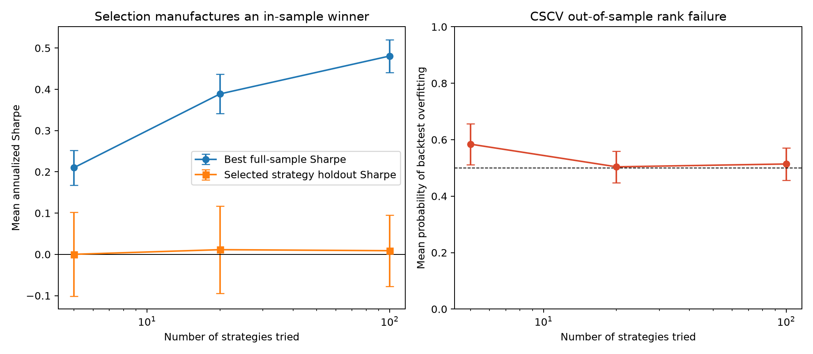

# Selection-bias experiment results

## Recorded run

Each row summarizes 40 independently simulated 20-year monthly datasets. Every
candidate strategy has zero true alpha and 4% monthly volatility, with a 0.25
common correlation. Intervals are normal-approximation 95% intervals for the
mean across repetitions.

| Candidates tried | Best full-sample Sharpe | Selected holdout Sharpe | Mean PBO |
| ---: | ---: | ---: | ---: |
| 5 | 0.210 [0.168, 0.252] | 0.000 [-0.101, 0.102] | 0.584 [0.511, 0.657] |
| 20 | 0.389 [0.341, 0.436] | 0.011 [-0.094, 0.117] | 0.504 [0.448, 0.560] |
| 100 | 0.481 [0.441, 0.520] | 0.009 [-0.078, 0.095] | 0.514 [0.457, 0.571] |

## Interpretation

Expanding the search from 5 to 100 configurations more than doubles the mean
best full-sample Sharpe, from 0.210 to 0.481, even though the simulation assigns
zero alpha to every candidate. The non-overlapping intervals make the direction
of this selection effect clear in the recorded design.

The first-half winner's mean holdout Sharpe remains approximately zero for every
candidate count. Its intervals include zero comfortably. The apparent winner
therefore does not preserve its advantage on untouched observations.

Mean PBO remains close to 0.5. Under the global null, the in-sample winner has
essentially random out-of-sample rank, so it falls below the median about half
the time. PBO is a diagnostic of ranking failure; it need not increase
monotonically with the number of candidates in this experiment.

## What this does not prove

The result does not show that all optimized strategies are false or that a
particular live strategy has zero alpha. It demonstrates a controlled mechanism:
searching a larger configuration set increases the best observed statistic even
when no candidate has genuine predictive value. A real application must retain
the complete research path, including failed and discarded configurations.
