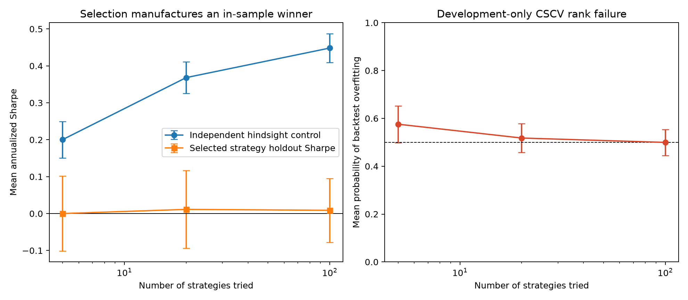

# Selection-bias experiment results

## Recorded run

Each row summarizes 40 independently simulated 20-year monthly datasets. Every
candidate strategy has zero true alpha and 4% monthly volatility, with a 0.25
common correlation. Intervals are normal-approximation 95% intervals for the
mean across repetitions. Selection and CSCV use the first 120 months; only the
frozen winner is evaluated on the final 120 months. The hindsight control uses
an independent 240-month dataset with the same zero-alpha generating process.

Regenerated September 22, 2026 with seed 17, Python 3.12.14, NumPy 2.5.3 and
pandas 3.0.6 using `MPLBACKEND=Agg python run_overfitting_study.py`. The committed
[manifest](measurements/selection-bias-manifest.json) records configuration,
source and output hashes; [summary CSV](measurements/selection-bias-summary.csv)
contains full precision. These supersede results from the earlier full-data
CSCV design.

| Candidates tried | Independent hindsight control | Selected holdout Sharpe | Development PBO |
| ---: | ---: | ---: | ---: |
| 5 | 0.200 [0.151, 0.249] | 0.000 [-0.101, 0.102] | 0.576 [0.499, 0.652] |
| 20 | 0.368 [0.325, 0.411] | 0.011 [-0.094, 0.117] | 0.518 [0.457, 0.579] |
| 100 | 0.448 [0.409, 0.488] | 0.009 [-0.078, 0.095] | 0.500 [0.445, 0.554] |

## Interpretation

Expanding the search from 5 to 100 configurations more than doubles the mean
independent hindsight-control Sharpe, from 0.200 to 0.448, even though the simulation assigns
zero alpha to every candidate. The non-overlapping intervals make the direction
of this selection effect clear in the recorded design.

The first-half winner's mean holdout Sharpe remains approximately zero for every
candidate count. Its intervals include zero comfortably. The apparent winner
therefore does not preserve its advantage on untouched observations.

Development PBO remains close to 0.5. Under the global null, the development-split winner has
essentially random complementary-development-split rank, so it falls below the median about half
the time. PBO is a diagnostic of ranking failure; it need not increase
monotonically with the number of candidates in this experiment.

## What this does not prove

The result does not show that all optimized strategies are false or that a
particular live strategy has zero alpha. It demonstrates a controlled mechanism:
searching a larger configuration set increases the best observed statistic even
when no candidate has genuine predictive value. A real application must retain
the complete research path, including failed and discarded configurations.
